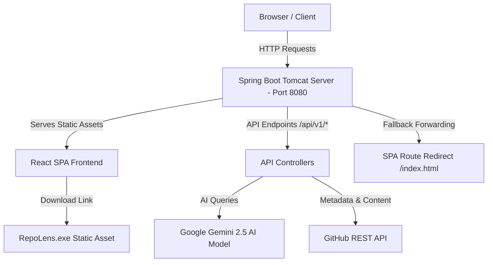

# RepoLens: AI-Powered GitHub Repository Discovery & Analysis

RepoLens is a premium, high-performance web and desktop platform designed to discover, scan, and audit GitHub repositories. Leveraging advanced AI summaries, health metrics, technology signature lookups, interactive code trees, and direct workspace downloads, RepoLens simplifies code discovery.

This repository is structured as a unified monorepo containing both the React frontend and Spring Boot backend, designed to compile and deploy under a single unified web service.

🌐 **Live Demo:** [https://repolens-7hhs.onrender.com](https://repolens-7hhs.onrender.com)

---

## 📖 Table of Contents
1. [System Architecture](#-system-architecture)
2. [Key Features & Capabilities](#-key-features--capabilities)
3. [Performance & Optimization Engine](#-performance--optimization-engine)
4. [Technology Stack](#-technology-stack)
5. [Unified Docker & Deployment Pipeline](#-unified-docker--deployment-pipeline)
6. [Desktop Launcher (`RepoLens.exe`)](#-desktop-launcher-repolensexe)
7. [Local Development Setup](#-local-development-setup)

---

## 🏗 System Architecture

RepoLens adopts a single-origin, unified architecture where the React SPA frontend is built and served directly by the Spring Boot embedded Tomcat container. This eliminates CORS concerns, optimizes static asset delivery, and enables single-service hosting (e.g., on Render).



### 1. Unified Single-Service Hosting
The React frontend static files are compiled into `dist` and copied into `src/main/resources/static/` of the backend resources during build time. The entire application runs as a single JAR package.

### 2. SPA Route Redirection
To support client-side routing (React Router) natively under Spring Boot, [WebViewController.java](file:///c:/Users/nvsai/Desktop/anti%20gravity/RepoLens/titansearch-backend/src/main/java/com/titansearch/controller/WebViewController.java) intercepts client browser refreshes on routes like `/repository/**` and forwards them internally to `/index.html`.

### 3. Origin-Relative API Routing
In production, frontend API fetches automatically omit base URLs and query relative endpoints (`/api/v1/...`). In local development mode (`npm run dev`), the client falls back to querying the backend service on `http://localhost:8080`.

---

## 🌟 Key Features & Capabilities

### 1. Centered Search & Discovery Base
- **Spring Layout Transitions**: On load, the search controls (Query text field, Language filters, Min Stars slider) are centered to emphasize focus. Submitting a search triggers a spring layout animation (powered by `framer-motion`) that shifts the inputs to the header, fading in results below.
- **Enriched Cards**: Hover-transforming result cards show license details, topics badges, visibility parameters, and instant AI summaries.

### 2. Public Authentication-Free Access & Branding
- **Zero Login Friction**: The application requires no login, signups, accounts, or profile setups. It operates entirely as a public auditing tool.
- **Custom Brand Identity**: Replaced generic symbols with the **RepoLens Logo** (a vector magnifying lens focusing on code editor brackets `< >`) and the tagline: *"AI-Powered GitHub Repository Discovery & Analysis"*.

### 3. Repository details view (70/30 Split)
- **Left Content Pane (70%)**: Features repository parameters, README markdown viewer, computed overall health metrics, code maturity metrics, and the files tree.
- **Right Sidebar (30%)**: Houses owner profiles, company locations, quick copy HTTP/SSH clone panels, bookmarks registry, and the **Direct ZIP Downloader** (which streams zipballs directly with progress-bar loading).
- **Gemini Chatbot Sidepanel**: Allows real-time messaging about the codebase with a temperature/creativity adjustment slider.

---

## ⚡ Performance & Optimization Engine

RepoLens incorporates advanced client-side caching and fetch cancellation architectures to feel instant:

### 1. Stale-While-Revalidate (SWR) Caching
- **Search Cache**: Page queries, slider parameters, and results lists are cached in memory. Navigating back from detail views restores states instantly.
- **Detail Metadata Cache**: Caches tech stacks, health score matrices, AI summaries, and structural diagrams per repository. Detail pages load in under 50ms.
- **File Explorer Cache**: Persists previously opened directory folders and file code drawer text previews in memory. Expanding, collapsing, and selecting files is instant.

### 2. HTTP ETag Conditional Requests
GitHub API profile lookups check locally stored ETags (`If-None-Match`). Unmodified assets return `304 Not Modified`, preserving rate limit quotas.

### 3. Query Abort Controllers
Pending backend search queries and repository details fetches are aborted instantly if the user updates parameters or navigates away. This prevents overlapping state commits, race conditions, and memory leaks.

---

## 🛠 Technology Stack

### Frontend
- **React 18** & **TypeScript**
- **Vite** (Build toolchain)
- **Framer Motion** (Spring layout animations)
- **Lucide React** (Branding iconography)

### Backend
- **Spring Boot 3.x** & **Java 21**
- **Maven** (Dependency manager)
- **Google Gemini Client** (Integrated with the `gemini-2.5-flash` model)

### Desktop Launcher
- **C# (.NET Framework)** (Compiles native executable wrapper)
- **PowerShell** (Automated zip extraction and packaging scripts)

---

## 🐳 Unified Docker & Deployment Pipeline

The project's root `Dockerfile` defines a 3-stage multi-stage builder to create a lightweight, optimized runtime image:

```dockerfile
# Stage 1: Build React SPA
FROM node:20-alpine AS frontend-build
WORKDIR /app
COPY titansearch-frontend/package*.json ./
RUN npm install
COPY titansearch-frontend/ ./
RUN npm run build

# Stage 2: Build Spring Boot Backend
FROM maven:3.9-amazoncorretto-21 AS backend-build
WORKDIR /app
COPY titansearch-backend/pom.xml ./
RUN mvn dependency:go-offline
COPY titansearch-backend/ ./
COPY --from=frontend-build /app/dist/ ./src/main/resources/static/
# Packages the precompiled desktop executable for direct user download
COPY RepoLens.exe ./src/main/resources/static/
RUN mvn clean package -DskipTests

# Stage 3: Run Application
FROM amazoncorretto:21-alpine
WORKDIR /app
COPY --from=backend-build /app/target/*.jar app.jar
EXPOSE 8080
ENV SPRING_PROFILES_ACTIVE=prod
ENTRYPOINT ["java", "-jar", "app.jar"]
```

---

## 💻 Desktop Application Download & Installation

RepoLens includes a native C# launcher and self-contained installer (`RepoLens.exe`) that deploys a local environment.

### 📥 Download Link
- **From Web App Browser (Recommended)**: Download directly from the sidebar of the running website at `/RepoLens.exe`.
- **From GitHub Releases**: 👉 **[Download RepoLens for Windows v0.2.0](https://github.com/nvsaigokul-sudo/RepoLens/releases/latest/download/RepoLens.exe)**

### 📋 Release Specifications
- **Current Version**: `v0.2.0`
- **File Size**: `32.48 MB`
- **Architecture**: `Windows 10 / 11 (64-bit)`
- **Dependencies**: Docker Desktop (required to run local databases and service containers)

### 🚀 Installation Instructions
1. **Prerequisites**: Ensure **Docker Desktop** is installed and running on your system.
2. **Download**: Click the download link above to fetch the `RepoLens.exe` installer.
3. **Execution**: Double-click `RepoLens.exe` to run the first-time setup wizard. The installer will automatically:
   - Extract the Spring Boot JAR runtime and React static assets to `%LocalAppData%\RepoLens\`.
   - Setup a local Docker Compose context and start all service containers.
   - Configure a clean uninstaller entry in Windows settings under Programs and Features.
   - Create desktop and Start Menu shortcuts.
4. **Onboarding**: Once services initialize, the browser automatically opens to `http://localhost:3000`. You will be welcomed by the onboarding setup screen, prompting you to enter your personal API keys (GitHub token and Gemini API key) which are validated on the spot and securely stored locally.

### 🗑 Uninstallation
To cleanly remove RepoLens from your machine, simply:
1. Open Windows **Apps & Features** / **Settings**.
2. Search for **RepoLens** and click **Uninstall**.
3. The uninstaller will automatically run `docker compose down -v` to purge container databases, delete shortcuts, remove registry keys, and wipe `%LocalAppData%\RepoLens\`.

---

## 🚀 Local Development Setup

### Prerequisites
- Java JDK 21
- Node.js 20+
- Maven 3.8+

### Step 1: Run the Backend
1. Navigate to the backend directory:
   ```bash
   cd titansearch-backend
   ```
2. Export your developer API keys in your terminal environment:
   ```bash
   export GITHUB_TOKEN="your_github_token"
   export GEMINI_API_KEY="your_gemini_api_key"
   ```
3. Run the Spring Boot application:
   ```bash
   mvn spring-boot:run
   ```

### Step 2: Run the Frontend
1. Navigate to the frontend directory:
   ```bash
   cd titansearch-frontend
   ```
2. Install dependencies:
   ```bash
   npm install
   ```
3. Run in developer hot-reload mode:
   ```bash
   npm run dev
   ```
4. Access the frontend in your browser at `http://localhost:5173`.

### Step 3: Package the Desktop Launcher
To compile changes into the self-contained launcher executable, execute the build script from a PowerShell terminal at the root:
```powershell
.\build_launcher.ps1
```
This generates the packaged client wrapper at `RepoLens.exe`.
