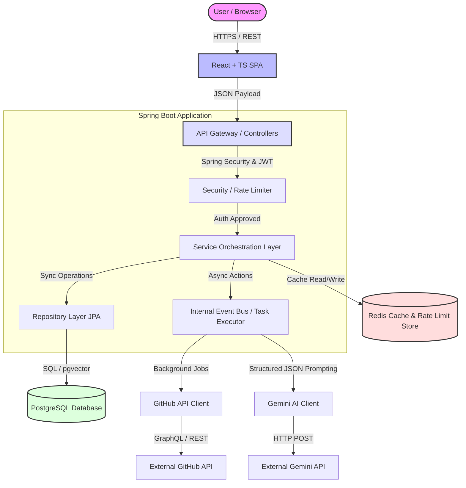
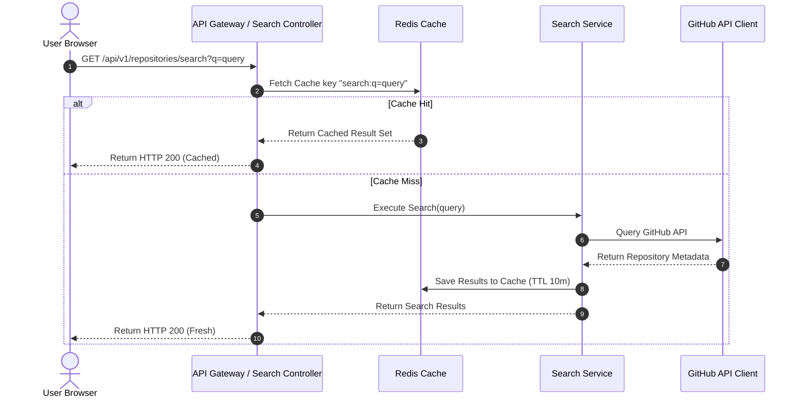
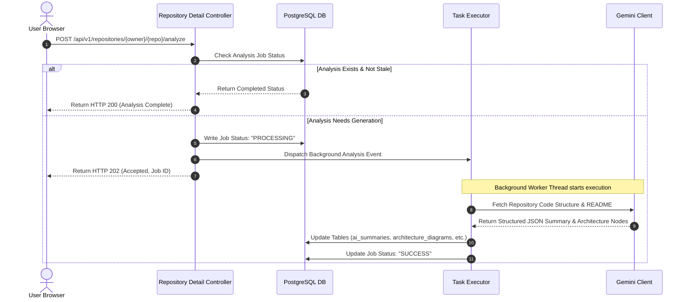

# TitanAtlas — Phase 1: Complete Architecture & Planning Documentation

## 1. Objective

TitanAtlas is a startup-grade SaaS platform engineered to help developers, students, recruiters, and engineering managers discover, analyze, compare, understand, and evaluate software repositories. 

While existing tools like GitHub Search are limited to basic metadata querying (names, descriptions, and stars), TitanAtlas delivers deep repository intelligence. It automatically detects tech stacks, evaluates code health, analyzes the repository's value on a resume, and synthesizes architectural visualizer maps and AI-powered summaries.

### 1.1 Target Users & Personas
* **Software Developers & Contributors (Primary)**: Need to evaluate library health before adopting, understand large open-source codebases quickly, and compare alternative projects.
* **Students & Learners (Primary)**: Need to find high-learning-value repositories, map out project architectures to learn design patterns, and understand code complexity.
* **Recruiters & Engineering Managers (Secondary)**: Need to assess candidates' public code portfolios, analyze the maturity of open-source projects, and determine the engineering relevance of specific repositories to the industry.

### 1.2 Tech Stack
* **Frontend**: React 18, TypeScript, TailwindCSS, Framer Motion, Zustand (client state), React Query / TanStack Query (server synchronization).
* **Backend**: Java 21, Spring Boot 3.3.x, Spring Data JPA, Spring Security (Stateless JWT), Bucket4j (Rate Limiting).
* **Databases**: PostgreSQL (System of record + Vector Search via `pgvector`).
* **Caching & Rate Limiting Store**: Redis (Cache-aside database proxy, API responses, rate-limit buckets).
* **AI Engine**: Gemini API (via structured JSON schema outputs).
* **Deployment**: Docker, Docker Compose, Flyway (DB migrations).

---

## 2. System Architecture

TitanAtlas uses a modular monolithic architecture, allowing rapid startup development while defining strict module boundaries that enable future extraction into microservices if needed.

### 2.1 High-Level Component View
The frontend Single Page Application (SPA) communicates via HTTPS with the Spring Boot backend gateway layer. The backend orchestrates database lookups, Redis cache operations, and async background analyses integrated with the GitHub REST/GraphQL and Gemini APIs.



### 2.2 System Component Design
* **React SPA (Frontend)**: Responsible for rendering fast search interfaces, interactive radial graphs for repository health, visual system architecture maps, and side-by-side repository comparisons.
* **API Gateway Layer (Controller)**: Handles routing, CORS negotiation, JWT extraction/validation, global exception handling, and request DTO validation.
* **Rate Limiter (Bucket4j + Redis)**: Protects downstream micro-services and third-party APIs from overload. Intercepts incoming requests before hitting business logic.
* **Service Orchestration Layer**: Contains pure business logic. Decouples controllers from repository structures.
* **External Client Layer**: Employs Resilience4j circuit breakers, retries, and rate limit throttling to securely connect to GitHub and Gemini.

### 2.3 System Data Flows

#### Flow A: Repository Search (Synchronous with Cache-Aside)
This flow ensures rapid search response times by prioritizing Redis caches and leveraging the GitHub API as a fallback source.



#### Flow B: Deep Analysis & AI Generation (Asynchronous Event-Driven)
Deep analysis (AI summarization, code architecture analysis, resume value) is decoupled from the search action. It runs asynchronously to avoid blocking user threads.



### 2.4 Service Boundaries
To maintain a clean codebase, the system is partitioned into the following functional domains:
1. **User Identity Domain (`com.repolens.auth`)**: Manages registration, logins, JWT signing, password hashing, and user profile management.
2. **Search Domain (`com.repolens.search`)**: Wraps GitHub API queries, local search cache checks, and search history persistence.
3. **Repository Detail Domain (`com.repolens.repository`)**: Maintains cached repository snapshots and orchestrates structural analysis requests.
4. **Intelligence Domain (`com.repolens.analysis`)**: Manages health score algorithms, technology heuristic scanners, and parsing dependencies.
5. **AI Generation Domain (`com.repolens.ai`)**: Wraps prompts, handles JSON schemas for Gemini, tracks token budgets, and formats resume scoring.
6. **Recommendation Domain (`com.repolens.recommendation`)**: Manages similarity scoring vectors and queries recommendations.

---

## 3. Database Design

We use PostgreSQL for transactional data persistence and leverage `pgvector` for storing embedding vectors representing repository topics and descriptions.

### 3.1 Entity-Relationship (ER) Diagram

```mermaid
erDiagram
    USERS {
        bigint id PK
        varchar email UK
        varchar password_hash
        varchar full_name
        varchar role
        timestamptz created_at
        timestamptz updated_at
    }
    REPOSITORIES {
        bigint id PK
        bigint github_id UK
        varchar full_name UK
        varchar owner
        text description
        integer stars
        integer forks
        integer open_issues
        varchar primary_language
        text readme_preview
        vector description_embedding
        timestamptz repo_created_at
        timestamptz repo_pushed_at
        timestamptz last_synced_at
        timestamptz created_at
    }
    REPO_TOPICS {
        bigint id PK
        bigint repository_id FK
        varchar topic
    }
    REPO_LANGUAGES {
        bigint id PK
        bigint repository_id FK
        varchar language
        bigint byte_count
        numeric percentage
    }
    TECH_STACK_DETECTIONS {
        bigint id PK
        bigint repository_id FK
        varchar category
        varchar technology
        numeric confidence
        timestamptz detected_at
    }
    HEALTH_SCORES {
        bigint id PK
        bigint repository_id FK "Unique"
        smallint overall_score
        smallint documentation_score
        smallint commit_activity_score
        smallint issues_score
        smallint popularity_score
        smallint maturity_score
        timestamptz computed_at
    }
    AI_SUMMARIES {
        bigint id PK
        bigint repository_id FK "Unique"
        text overview
        text main_purpose
        text architecture_summary
        text key_technologies
        text learning_value
        varchar model_version
        timestamptz generated_at
    }
    RESUME_ANALYSES {
        bigint id PK
        bigint repository_id FK
        bigint user_id FK
        numeric resume_score
        text strengths
        text weaknesses
        text industry_relevance
        text suggested_improvements
        timestamptz generated_at
    }
    ARCHITECTURE_DIAGRAMS {
        bigint id PK
        bigint repository_id FK "Unique"
        jsonb diagram_json
        varchar diagram_type
        timestamptz generated_at
    }
    SIMILAR_REPOSITORIES {
        bigint id PK
        bigint repository_id FK
        bigint similar_repository_id FK
        numeric similarity_score
        varchar reason
    }
    USER_FAVORITES {
        bigint id PK
        bigint user_id FK
        bigint repository_id FK
        timestamptz created_at
    }
    SEARCH_HISTORY {
        bigint id PK
        bigint user_id FK "Nullable"
        varchar query
        jsonb filters
        integer result_count
        timestamptz created_at
    }

    USERS ||--o{ USER_FAVORITES : "saves"
    USERS ||--o{ SEARCH_HISTORY : "performs"
    USERS ||--o{ RESUME_ANALYSES : "triggers"
    REPOSITORIES ||--o{ USER_FAVORITES : "favorited_by"
    REPOSITORIES ||--o{ REPO_TOPICS : "has"
    REPOSITORIES ||--o{ REPO_LANGUAGES : "uses"
    REPOSITORIES ||--o{ TECH_STACK_DETECTIONS : "runs"
    REPOSITORIES ||--o{ HEALTH_SCORES : "evaluates"
    REPOSITORIES ||--o{ AI_SUMMARIES : "summarized_by"
    REPOSITORIES ||--o{ RESUME_ANALYSES : "assesses"
    REPOSITORIES ||--o{ ARCHITECTURE_DIAGRAMS : "maps"
    REPOSITORIES ||--o{ SIMILAR_REPOSITORIES : "associates"
```



### 3.2 Schema Definition & SQL Constraints

Below are the schema specifications mapping directly to database creation statements.

#### 1. Table: `users`
* `id` (BIGINT, PK, Identity): Primary identifier.
* `email` (VARCHAR(255), Unique, Not Null): User login identifier. Checked with regex format constraint.
* `password_hash` (VARCHAR(255), Not Null): Argon2id or BCrypt hash value.
* `full_name` (VARCHAR(150), Null): User display name.
* `role` (VARCHAR(20), Not Null, Default 'USER'): Role system (`USER`, `RECRUITER`, `ADMIN`).
* `created_at` (TIMESTAMPTZ, Default `NOW()`): Creation timestamp.
* `updated_at` (TIMESTAMPTZ, Default `NOW()`): Last update timestamp.

#### 2. Table: `repositories`
* `id` (BIGINT, PK, Identity): Primary key.
* `github_id` (BIGINT, Unique, Not Null): GitHub internal immutable repository identifier.
* `full_name` (VARCHAR(255), Unique, Not Null): e.g. `owner/repo_name`. Indexed for search lookups.
* `owner` (VARCHAR(150), Not Null): Repository owner organization or username.
* `description` (TEXT, Null): Raw GitHub repository description.
* `stars` (INT, Default 0): Star count. Must be `>= 0`.
* `forks` (INT, Default 0): Fork count. Must be `>= 0`.
* `open_issues` (INT, Default 0): Open issue count. Must be `>= 0`.
* `primary_language` (VARCHAR(50), Null): Main language returned by GitHub.
* `readme_preview` (TEXT, Null): First 4000 characters of the repository README.md.
* `description_embedding` (VECTOR(1536), Null): 1536-dimensional vector embedding for Gemini similarity mapping.
* `repo_created_at` (TIMESTAMPTZ, Not Null): Time the repository was created on GitHub.
* `repo_pushed_at` (TIMESTAMPTZ, Not Null): Last commit push date on GitHub.
* `last_synced_at` (TIMESTAMPTZ, Not Null): Last timestamp TitanAtlas pulled updates from GitHub.
* `created_at` (TIMESTAMPTZ, Default `NOW()`): Record creation timestamp.

#### 3. Table: `repo_topics`
* `id` (BIGINT, PK, Identity)
* `repository_id` (BIGINT, FK, Not Null): References `repositories(id)` with `ON DELETE CASCADE`.
* `topic` (VARCHAR(100), Not Null): Singular topic name.
* *Constraints*: Unique composite index on `(repository_id, topic)`.

#### 4. Table: `repo_languages`
* `id` (BIGINT, PK, Identity)
* `repository_id` (BIGINT, FK, Not Null): References `repositories(id)` with `ON DELETE CASCADE`.
* `language` (VARCHAR(50), Not Null): Language name.
* `byte_count` (BIGINT, Not Null, Check `>= 0`)
* `percentage` (NUMERIC(5,2), Not Null, Check `percentage BETWEEN 0.00 AND 100.00`)
* *Constraints*: Unique composite index on `(repository_id, language)`.

#### 5. Table: `tech_stack_detections`
* `id` (BIGINT, PK, Identity)
* `repository_id` (BIGINT, FK, Not Null): References `repositories(id)` with `ON DELETE CASCADE`.
* `category` (VARCHAR(30), Not Null): `BACKEND`, `FRONTEND`, `DATABASE`, `INFRA`.
* `technology` (VARCHAR(50), Not Null): e.g., `Spring Boot`, `React`, `PostgreSQL`, `Docker`.
* `confidence` (NUMERIC(4,3), Check `confidence BETWEEN 0.000 AND 1.000`): Scanner heuristic certainty rating.

#### 6. Table: `health_scores`
* `id` (BIGINT, PK, Identity)
* `repository_id` (BIGINT, FK, Unique, Not Null): References `repositories(id)` with `ON DELETE CASCADE`.
* `overall_score` (SMALLINT, Check `overall_score BETWEEN 0 AND 100`)
* `documentation_score` (SMALLINT, Check `documentation_score BETWEEN 0 AND 100`)
* `commit_activity_score` (SMALLINT, Check `commit_activity_score BETWEEN 0 AND 100`)
* `issues_score` (SMALLINT, Check `issues_score BETWEEN 0 AND 100`)
* `popularity_score` (SMALLINT, Check `popularity_score BETWEEN 0 AND 100`)
* `maturity_score` (SMALLINT, Check `maturity_score BETWEEN 0 AND 100`)
* `computed_at` (TIMESTAMPTZ, Default `NOW()`)

#### 7. Table: `ai_summaries`
* `id` (BIGINT, PK, Identity)
* `repository_id` (BIGINT, FK, Unique, Not Null): References `repositories(id)` with `ON DELETE CASCADE`.
* `overview` (TEXT, Not Null): Core overview.
* `main_purpose` (TEXT, Not Null): Key objectives.
* `architecture_summary` (TEXT, Not Null): Software architectural style overview.
* `key_technologies` (TEXT, Not Null): Bullet points with descriptions.
* `learning_value` (TEXT, Not Null): Why a developer should study this codebase.
* `model_version` (VARCHAR(50), Not Null): Model tag (e.g., `gemini-1.5-flash`).
* `generated_at` (TIMESTAMPTZ, Default `NOW()`)

#### 8. Table: `resume_analyses`
* `id` (BIGINT, PK, Identity)
* `repository_id` (BIGINT, FK, Not Null): References `repositories(id)` with `ON DELETE CASCADE`.
* `user_id` (BIGINT, FK, Not Null): References `users(id)` with `ON DELETE CASCADE`.
* `resume_score` (NUMERIC(3,1), Check `resume_score BETWEEN 0.0 AND 10.0`): Value mapping.
* `strengths` (TEXT, Not Null): Structural Markdown.
* `weaknesses` (TEXT, Not Null)
* `industry_relevance` (TEXT, Not Null)
* `suggested_improvements` (TEXT, Not Null)
* `generated_at` (TIMESTAMPTZ, Default `NOW()`)

#### 9. Table: `architecture_diagrams`
* `id` (BIGINT, PK, Identity)
* `repository_id` (BIGINT, FK, Unique, Not Null): References `repositories(id)` with `ON DELETE CASCADE`.
* `diagram_json` (JSONB, Not Null): Nodes and Edges mapping schema.
* `diagram_type` (VARCHAR(30), Default 'LAYERED')
* `generated_at` (TIMESTAMPTZ, Default `NOW()`)

#### 10. Table: `similar_repositories`
* `id` (BIGINT, PK, Identity)
* `repository_id` (BIGINT, FK, Not Null): References `repositories(id)` with `ON DELETE CASCADE`.
* `similar_repository_id` (BIGINT, FK, Not Null): References `repositories(id)` with `ON DELETE CASCADE`.
* `similarity_score` (NUMERIC(4,3), Check `similarity_score BETWEEN 0.000 AND 1.000`)
* `reason` (VARCHAR(255), Not Null)
* *Constraints*: Unique index on `(repository_id, similar_repository_id)`. Check constraint preventing self-referencing links: `repository_id != similar_repository_id`.

#### 11. Table: `user_favorites`
* `id` (BIGINT, PK, Identity)
* `user_id` (BIGINT, FK, Not Null): References `users(id)` with `ON DELETE CASCADE`.
* `repository_id` (BIGINT, FK, Not Null): References `repositories(id)` with `ON DELETE CASCADE`.
* `created_at` (TIMESTAMPTZ, Default `NOW()`)
* *Constraints*: Unique index on `(user_id, repository_id)`.

#### 12. Table: `search_history`
* `id` (BIGINT, PK, Identity)
* `user_id` (BIGINT, FK, Nullable): References `users(id)` with `ON DELETE SET NULL`.
* `query` (VARCHAR(500), Not Null)
* `filters` (JSONB, Null)
* `result_count` (INT, Default 0)
* `created_at` (TIMESTAMPTZ, Default `NOW()`)

### 3.3 Indexing Strategy
To ensure startup performance does not degrade as metadata volume increases:
* **Composite Indexes**:
  * `idx_repo_owner_name`: `repositories(owner, name)` for rapid route mapping lookup.
  * `idx_fav_user_repo`: `user_favorites(user_id, repository_id)` for lightning-fast verification queries.
* **Functional Indexes**:
  * `idx_repo_stars_desc`: B-Tree on `repositories(stars DESC)` for default ranking and popularity queries.
  * `idx_repo_pushed`: B-Tree on `repositories(repo_pushed_at DESC)`.
* **GIN Indexes (Generalized Inverted Index)**:
  * `idx_search_filters`: GIN on `search_history(filters)` to support fast searching through stored filter history configurations.
  * `idx_arch_json`: GIN on `architecture_diagrams(diagram_json)` for querying inner structures.
* **Vector Index**:
  * `idx_repo_vector_cosine`: HNSW (Hierarchical Navigable Small World) index on `repositories(description_embedding vector_cosine_ops)` to optimize similarity recommendations.

---

## 4. Backend Structure

The Spring Boot application follows Clean Architecture guidelines. Components are isolated by clear layer boundaries.

### 4.1 Modular Package Structure

```
com.titanatlas/
│
├── TitanAtlasApplication.java
│
├── config/                              # Cross-cutting Bean Definitions
│   ├── SecurityConfig.java              # Spring Security Config (JWT, CORS, Paths)
│   ├── RedisConfig.java                 # CacheManager & RedisTemplate setup
│   ├── RestClientConfig.java            # Configured RestClient templates
│   ├── RateLimitConfig.java             # Bucket4j configurations
│   ├── OpenApiConfig.java               # Swagger / OpenAPI documentation beans
│   └── ThreadPoolConfig.java            # Async Executor pools configuration
│
├── controller/                          # REST Web Controllers (Incoming DTO -> Service -> Response DTO)
│   ├── auth/
│   │   └── AuthController.java
│   ├── search/
│   │   └── SearchController.java
│   ├── repository/
│   │   ├── RepositoryDetailController.java
│   │   └── FavoriteController.java
│   └── analysis/
│       ├── HealthScoreController.java
│       ├── TechStackController.java
│       ├── AISummaryController.java
│       ├── ArchitectureController.java
│       └── ResumeAnalysisController.java
│
├── service/                             # Pure business logic interfaces & implementations
│   ├── auth/
│   │   ├── AuthService.java
│   │   ├── AuthServiceImpl.java
│   │   ├── JwtService.java
│   │   └── JwtServiceImpl.java
│   ├── search/
│   │   ├── SearchService.java
│   │   └── SearchServiceImpl.java
│   ├── repository/
│   │   ├── RepositoryService.java
│   │   ├── RepositoryServiceImpl.java
│   │   ├── FavoriteService.java
│   │   └── FavoriteServiceImpl.java
│   ├── analysis/
│   │   ├── HealthScoreService.java
│   │   ├── HealthScoreServiceImpl.java
│   │   ├── TechStackService.java
│   │   ├── TechStackServiceImpl.java
│   │   ├── ArchitectureService.java
│   │   └── ArchitectureServiceImpl.java
│   ├── ai/
│   │   ├── AISummaryService.java
│   │   ├── AISummaryServiceImpl.java
│   │   ├── ResumeService.java
│   │   ├── ResumeServiceImpl.java
│   │   ├── GeminiClient.java
│   │   └── GeminiClientImpl.java
│   └── github/
│       ├── GitHubClient.java
│       ├── GitHubClientImpl.java
│       ├── GitHubSyncService.java
│       └── GitHubSyncServiceImpl.java
│
├── repository/                          # Spring Data JPA interfaces
│   ├── UserRepository.java
│   ├── RepositoryRepository.java
│   ├── RepoTopicRepository.java
│   ├── RepoLanguageRepository.java
│   ├── TechStackDetectionRepository.java
│   ├── HealthScoreRepository.java
│   ├── AISummaryRepository.java
│   ├── ResumeAnalysisRepository.java
│   ├── ArchitectureDiagramRepository.java
│   ├── SimilarRepositoryRepository.java
│   ├── UserFavoriteRepository.java
│   └── SearchHistoryRepository.java
│
├── entity/                              # Database Domain Models (JPA @Entity objects)
│   ├── User.java
│   ├── RepositoryEntity.java
│   └── ... (matches ER Diagram entities 1:1)
│
├── dto/                                 # Data Transfer Objects
│   ├── request/
│   │   ├── RegisterRequest.java
│   │   ├── LoginRequest.java
│   │   └── SearchFiltersRequest.java
│   └── response/
│       ├── ApiResponseEnvelope.java      # Standard { data, meta, error } response wrapper
│       ├── AuthResponse.java
│       ├── RepositorySearchResponse.java
│       ├── HealthScoreResponse.java
│       └── ...
│
├── mapper/                              # MapStruct converters (Entity <-> DTO)
│   ├── UserMapper.java
│   └── RepositoryMapper.java
│
├── exception/                           # Error Handling Components
│   ├── GlobalExceptionHandler.java
│   ├── ApiException.java
│   ├── EntityNotFoundException.java
│   ├── GitHubRateLimitException.java
│   └── GeminiServiceException.java
│
└── security/                            # Security Context Components
    ├── JwtAuthFilter.java
    ├── UserDetailsServiceImpl.java
    └── SecurityUtils.java
```

### 4.2 Layer Design Rules
To maintain decoupling and unit testability:
1. **Controllers** are strictly thin. They perform request body validation using Spring `@Valid`, pass execution arguments to the **Service Layer**, map returned domain objects to Response DTOs, and wrap them in a standard response envelope. They do not handle database entities directly.
2. **Services** are built against interfaces. The concrete implementation layers are hidden from the Controllers. Services orchestrate transactions (`@Transactional`), manage repository interaction, resolve business rules, and trigger external API calls.
3. **External Clients** (GitHub, Gemini) are abstracted through service wrappers. If the platform swaps Gemini for Claude or Anthropic, only the implementation details inside `GeminiClientImpl` change, keeping service consumers untouched.

---

## 5. Frontend Architecture

The React application is structured to ensure fast rendering, clean code reuse, and seamless data synchronization.

### 5.1 Project Layout (TypeScript React)
```
titanatlas-frontend/
├── public/
├── src/
│   ├── assets/                          # Images, global icons, fonts
│   ├── components/                      # Global Reusable UI Components
│   │   ├── ui/                          # Radix/Primitive components (buttons, inputs, dialogues)
│   │   │   ├── Button.tsx
│   │   │   ├── Input.tsx
│   │   │   └── Dialog.tsx
│   │   ├── layout/                      # Application shells and frames
│   │   │   ├── Navbar.tsx
│   │   │   ├── Sidebar.tsx
│   │   │   └── Footer.tsx
│   │   └── shared/                      # Logic-bound reuse components
│   │       ├── RepositoryCard.tsx
│   │       └── SearchBar.tsx
│   │
│   ├── features/                        # Domain-scoped modules (contains components, hooks, api-queries)
│   │   ├── auth/
│   │   ├── search/
│   │   ├── repository-detail/
│   │   │   ├── components/
│   │   │   │   ├── HealthScoreWidget.tsx
│   │   │   │   ├── TechStackTags.tsx
│   │   │   │   ├── AISummaryDisplay.tsx
│   │   │   │   └── ArchitectureDiagram.tsx
│   │   │   └── hooks/
│   │   │       └── useRepositoryAnalysis.ts
│   │   ├── dashboard/
│   │   └── resume-analyzer/
│   │
│   ├── hooks/                           # Global utility hooks (useTheme, useDebounce)
│   ├── services/                        # API client setup (Axios, interceptors)
│   │   └── api.ts
│   ├── store/                           # Global client state (Zustand)
│   │   └── useAuthStore.ts
│   ├── types/                           # Global TypeScript Interface Definitions
│   │   └── index.ts
│   ├── utils/                           # Formatters, checkers, charts configuration
│   ├── App.tsx
│   ├── index.css                        # Global Tailwind styles
│   └── main.tsx
├── tailwind.config.js
├── tsconfig.json
└── vite.config.ts
```

### 5.2 State Management Strategy
We separate frontend state into two categories:
1. **Client UI State (Zustand)**: Used for lightweight local storage values like theme parameters (dark/light), active sidebar layout toggles, search search terms, and current user token pointers.
2. **Server Cache State (React Query / TanStack Query)**: Manages all server API interactions (repositories search results, details, favorites).
   * *Caching*: Automatically caches API responses based on query keys (e.g., `['repo', owner, repo]`).
   * *Polling & Invalidation*: Implements smooth reloading patterns. If a user favorites a repository, the `['favorites']` cache key is invalidated, prompting an automatic refresh in the background without refreshing the page.

---

## 6. API Design

All API communication is executed over HTTPS with requests and responses wrapped in a standard JSON envelope:

```json
{
  "data": null,
  "meta": {
    "timestamp": "2026-07-02T15:40:00Z",
    "cached": false
  },
  "error": {
    "code": "ERROR_CODE",
    "message": "Human readable error detail"
  }
}
```

### 6.1 Core Endpoints & Payloads

#### 1. Search Repositories
* **Endpoint**: `GET /api/v1/repositories/search`
* **Access**: Public
* **Params**:
  * `q` (String, Required): Search query, min 2 chars.
  * `language` (String, Optional): Programming language filter.
  * `minStars` (Integer, Optional): Minimum star count.
  * `page` (Integer, Default 0): Pagination index.
  * `size` (Integer, Default 20): Results per page.
* **Response `data` JSON**:
```json
{
  "content": [
    {
      "id": 1024,
      "fullName": "spring-projects/spring-boot",
      "owner": "spring-projects",
      "name": "spring-boot",
      "description": "Spring Boot helps you create Spring-powered, production-grade applications.",
      "stars": 76320,
      "forks": 41200,
      "primaryLanguage": "Java",
      "lastPushedAt": "2026-07-01T22:15:30Z"
    }
  ],
  "pageNumber": 0,
  "pageSize": 20,
  "totalElements": 432,
  "totalPages": 22
}
```

#### 2. Get Repository Details
* **Endpoint**: `GET /api/v1/repositories/{owner}/{repo}`
* **Access**: Public
* **Response `data` JSON**:
```json
{
  "id": 1024,
  "githubId": 293284,
  "fullName": "spring-projects/spring-boot",
  "owner": "spring-projects",
  "description": "Spring Boot helps you create Spring-powered, production-grade applications.",
  "stars": 76320,
  "forks": 41200,
  "openIssues": 342,
  "primaryLanguage": "Java",
  "readmePreview": "# Spring Boot ...",
  "languages": [
    { "language": "Java", "percentage": 98.2 },
    { "language": "HTML", "percentage": 1.8 }
  ],
  "topics": ["spring", "java", "framework", "bootstrap"],
  "lastSyncedAt": "2026-07-02T10:00:00Z"
}
```

#### 3. Trigger/Fetch Health Score
* **Endpoint**: `GET /api/v1/repositories/{owner}/{repo}/health-score`
* **Access**: Public
* **Response `data` JSON**:
```json
{
  "overallScore": 89,
  "breakdown": {
    "documentationScore": 95,
    "commitActivityScore": 90,
    "issuesScore": 75,
    "popularityScore": 100,
    "maturityScore": 85
  },
  "computedAt": "2026-07-02T11:00:00Z"
}
```

#### 4. Trigger/Fetch AI Summary
* **Endpoint**: `GET /api/v1/repositories/{owner}/{repo}/ai-summary`
* **Access**: Authenticated User
* **Response `data` JSON**:
```json
{
  "id": 55,
  "overview": "Spring Boot simplifies the configuration and deployment of enterprise-grade Java web applications.",
  "mainPurpose": "To eliminate boiler-plate XML configurations and provide rapid standalone application initialization.",
  "architectureSummary": "Standard layered architecture model featuring web controllers, business services, and database persistence mapping via JPA.",
  "keyTechnologies": "Spring Framework, Embedded Tomcat Engine, Logback, Jackson Dataformat.",
  "learningValue": "Excellent study candidate for studying structural modular configuration patterns and enterprise class structures.",
  "generatedAt": "2026-07-02T14:22:00Z"
}
```

#### 5. Trigger/Fetch Architecture Diagram Layout
* **Endpoint**: `GET /api/v1/repositories/{owner}/{repo}/architecture`
* **Access**: Public
* **Response `data` JSON**:
```json
{
  "repositoryId": 1024,
  "diagramType": "LAYERED",
  "diagramJson": {
    "nodes": [
      { "id": "n1", "label": "Spring MVC Controller", "layer": "PRESENTATION", "description": "Exposes HTTP endpoints" },
      { "id": "n2", "label": "Security Filters", "layer": "SECURITY", "description": "Handles authentication/authorization" },
      { "id": "n3", "label": "Spring Service Beans", "layer": "BUSINESS", "description": "Encapsulates business operations" },
      { "id": "n4", "label": "Spring Data JPA Repository", "layer": "PERSISTENCE", "description": "Maps entity queries to DB" }
    ],
    "edges": [
      { "from": "n1", "to": "n2", "type": "DEPENDS_ON" },
      { "from": "n2", "to": "n3", "type": "CALLS" },
      { "from": "n3", "to": "n4", "type": "MUTATES" }
    ]
  },
  "generatedAt": "2026-07-02T14:30:00Z"
}
```

#### 6. Trigger Resume Analysis
* **Endpoint**: `POST /api/v1/repositories/{owner}/{repo}/resume-analysis`
* **Access**: Authenticated User (Rate Limited to 5 requests per day)
* **Response `data` JSON**:
```json
{
  "resumeScore": 8.5,
  "strengths": "- Prominent usage of concurrent Java collections\n- Rigorous unit testing setups via Mockito and JUnit 5",
  "weaknesses": "- Missing structural code coverage configurations\n- Unoptimized Dockerfile configuration utilizing bloated baseline images",
  "industryRelevance": "High alignment with Enterprise SaaS platforms requiring high-performance concurrent request processing.",
  "suggestedImprovements": "1. Transition to multi-stage Docker builds to reduce image weight.\n2. Incorporate JaCoCo code coverage plugins in maven build configurations.",
  "generatedAt": "2026-07-02T15:00:00Z"
}
```

### 6.2 Request Validation Rules
* **Search Filters Validation**:
  * `q`: `@NotBlank`, `@Size(min = 2, max = 100)`.
  * `minStars`: `@Min(0)`.
  * `page`: `@Min(0)`, `size`: `@Min(1), @Max(100)`.
* **Registration Validation**:
  * `email`: `@Email(regexp = "^[A-Za-z0-9._%+-]+@[A-Za-z0-9.-]+\\.[A-Za-z]{2,6}$")`.
  * `password`: `@NotBlank`, `@Pattern(regexp = "^(?=.*[0-9])(?=.*[a-z])(?=.*[A-Z])(?=.*[@#$%^&+=])(?=\\S+$).{8,20}$")` (ensures strong passwords with symbols, numbers, and case-mix).

---

## 7. Security Design

TitanAtlas is built with a defense-in-depth posture to protect user identities and prevent API abuse.

### 7.1 JWT Authentication & Session Management
All authenticated requests utilize stateless JWT Bearer authorization.

```
       USER CLIENT                                       SPRING BACKEND
           │                                                   │
           ├────────────── Login Credentials ─────────────────>│  Verify passwords via BCrypt
           │                                                   │  Sign Tokens with HMAC-SHA256
           │<────────── Access Token + Refresh Token ──────────┤  (Refresh Token HTTP-Only Cookie)
           │                                                   │
           │                                                   │
   Next Requests
           │                                                   │
           ├──────── Request Header: Bearer AccessToken ──────>│  Validate signature and expiration
           │                                                   │  Load context into SecurityHolder
           │<──────────────── HTTP 200 OK ─────────────────────┤
           │                                                   │
   Access Token Expires (15 mins)
           │                                                   │
           ├──────── Request Header: Bearer AccessToken ──────>│  Token signature check fails (expired)
           │<──────────────── HTTP 401 Unauthorized ───────────┤
           │                                                   │
   Silent Refresh
           │                                                   │
           ├──────── POST /auth/refresh (Cookie Refresh) ─────>│  Validate Refresh Token from DB
           │                                                   │  Generate new Access Token
           │<────────────── New Access Token ──────────────────┤
```

* **Access Token**: Short lived (15 minutes). Transmitted via headers `Authorization: Bearer <token>`. Contains user claims, email, and security role.
* **Refresh Token**: Long lived (7 days). Saved in database `user_sessions` and set on client as a secure `HttpOnly`, `SameSite=Strict`, `Secure` cookie. Enables silent refresh without storing keys in JavaScript-readable storage (mitigating XSS).

### 7.2 Role-Based Access Control (RBAC)

| Role | Permissions |
|---|---|
| **Anonymous/Public** | Read-only access to repository search, repository details, technology tags, and architecture diagrams. |
| **USER** | All public routes + Trigger AI Summaries, analyze resumes, save favorites, view search history, force repo re-syncs. |
| **RECRUITER** | All USER permissions + Bulk export candidate resume analyses, perform aggregate searches. |
| **ADMIN** | Full system configurations, dashboard diagnostics, invalidating cache states, manual rate-limiting updates. |

### 7.3 Rate Limiting Profile

Rate limiting is enforced at the controller entrypoint using Bucket4j, backed by Redis to support clustered backend environments.

* **Public Endpoint Limit**: 60 requests/minute per client IP (for `/search`, `/detail`).
* **Authenticated User Limit**: 120 requests/minute per authenticated token.
* **AI & Heavy Analysis Endpoints**: 5 requests/day for standard `USER` role; 50 requests/day for `RECRUITER` role.

---

## 8. Observability Design

To achieve production reliability, the observability system tracks detailed system metrics, application health, and structured logging.

```
  ┌─────────────────────────────────────────────────────────────┐
  │                   SPRING ACTUATOR ENGINE                    │
  ├──────────────────┬──────────────────┬───────────────────────┤
  │   /actuator/health   │   /actuator/metrics  │   /actuator/prometheus │
  └────────┬─────────┘──────────┬───────┘──────────┬────────────┘
           │                    │                  │
           ▼                    ▼                  ▼
      K8s Liveness/        Application JVM    Prometheus Server
      Readiness checks     Diagnostics        Scrape Target
```

### 8.1 Structured Logging (MDC Logging)
Logs are output as structured JSON objects via Logback config for easy ingestion by log aggregators (e.g. ELK, Datadog). 

* **Trace Context Tracking**: A custom filter assigns a unique correlation ID (`trace_id`) to the Mapped Diagnostic Context (MDC) for every incoming request. This `trace_id` is propagated to outgoing threads, database operations, and external API requests.
* **Example JSON Log Entry**:
```json
{
  "@timestamp": "2026-07-02T15:40:02.123Z",
  "level": "ERROR",
  "trace_id": "c62b-45b9-97d8",
  "user_id": 9410,
  "logger": "com.titanatlas.service.ai.GeminiClientImpl",
  "message": "Gemini API call failed with status 429 Too Many Requests.",
  "exception": "com.titanatlas.exception.GeminiServiceException: Rate limit exceeded"
}
```

### 8.2 Metrics & Dashboard Setup
We configure Micrometer to collect custom metrics in Prometheus format:
* **Custom Business Metrics**:
  * `titanatlas.ai.calls.total`: Counter matching executions of Gemini APIs.
  * `titanatlas.ai.calls.latency`: Timer monitoring duration of Gemini requests.
  * `titanatlas.ai.cost.dollars`: Gauge estimating API cost accumulators based on token sizes.
  * `titanatlas.github.api.calls`: Counter indicating GitHub API hits.
* **Infrastructure Alerts**:
  * Trigger alert if DB connection pool usage is $> 90\%$ for over 2 minutes.
  * Trigger alert if HTTP 5xx responses exceed $2\%$ of total traffic in a 5-minute window.

---

## 9. Scalability Plan

TitanAtlas relies heavily on third-party APIs. Thus, scalability is heavily tied to caching and API cost management.

```
                                  GET /detail/owner/repo
                                            │
                                    [Redis Check]
                                   /             \
                             [Hit]                 [Miss]
                            /                       \
             Return cached repo details         Fetch from GitHub
                                                Generate AI Summary
                                                Save to Redis & PG
```

### 9.1 Redis Caching & Cache-Aside Architecture
We configure Redis with different Time-To-Live (TTL) strategies depending on the data type:

| Data Type | Cache Pattern | TTL | Eviction Strategy |
|---|---|---|---|
| **GitHub Search Results** | Cache-Aside (Key: `search:q:lang:page`) | 10 Minutes | `volatile-lru` |
| **Repository Raw Metadata** | Cache-Aside (Key: `repo:owner:name`) | 12 Hours | `volatile-lru` |
| **System Health Scores** | Cache-Aside (Key: `health:repo_id`) | 24 Hours | `volatile-lru` |
| **User Session / Tokens** | Session Store (Key: `session:user_id`) | 7 Days | `noeviction` |

* **Cache Stampede Prevention**: When a high-traffic cache item expires, we use Redis distributed locks (Redisson) so only one backend worker queries the database or API, preventing database connection pool depletion.

### 9.2 AI Token Cost Control
* **Context Budget Controls**: We limit the content size sent to Gemini. Readme previews are cut off at 4,000 characters. Code structural analyses are limited to file trees and packages up to three layers deep.
* **Caching Prompts**: The structured prompt is system-cached. System prompt guidelines are set as instructions inside the model initialization rather than standard text payloads.

---

## 10. UI Wireframes

### 10.1 Page 1: Repository Search Dashboard

```
+----------------------------------------------------------------------------------+
|  TitanAtlas  [ Search Repositories...                       ] (Theme) [Sign In]  |
+----------------------------------------------------------------------------------+
|  Filters: [ Language: Java v ] [ Stars: >1000 v ] [ Tech: Spring Boot v ]        |
+----------------------------------------------------------------------------------+
|                                                                                  |
|  Results (432 found)                                                             |
|  +----------------------------------------------------------------------------+  |
|  | spring-projects / spring-boot                          [★ 76.3k] [Forks 41k]  |
|  | Spring Boot helps you create Spring-powered applications.                   |
|  | Tags: [java] [spring] [framework]   Tech: [Spring Boot] [Tomcat] [Logback]   |
|  | Health Score: [ 89 / 100 ]            Last Activity: 2 hours ago            |
|  +----------------------------------------------------------------------------+  |
|  +----------------------------------------------------------------------------+  |
|  | spring-cloud / spring-cloud-commons                    [★ 12.1k] [Forks 8k]   |
|  | Common utilities for Spring Cloud frameworks.                                |
|  | Tags: [java] [spring-cloud]         Tech: [Spring Boot] [Netflix Eureka]     |
|  | Health Score: [ 78 / 100 ]            Last Activity: 1 day ago              |
|  +----------------------------------------------------------------------------+  |
|                                                                                  |
+----------------------------------------------------------------------------------+
```

### 10.2 Page 2: Repository Detail Page

```
+----------------------------------------------------------------------------------+
|  TitanAtlas  < Back to Search  [spring-projects / spring-boot]  (★ Fav) [Profile] |
+----------------------------------------------------------------------------------+
|  [ Overview ]  [ Tech Stack ]  [ AI Summary ]  [ Health Score ]  [ Resume Value ]|
+----------------------------------------------------------------------------------+
|                                                                                  |
|  +------------------------------------++---------------------------------------+ |
|  | AI Repository Summary              || Health Score Analysis: 89 / 100       | |
|  |                                    ||                                       | |
|  | Overview:                          ||  [==================] Documentation 95| |
|  | Rapid application bootstrap engine.||  [================  ] Activity 90     | |
|  |                                    ||  [============      ] Issues 75       | |
|  | Architecture:                      ||  [==================] Popularity 100  | |
|  | Layered model controller.          ||  [================  ] Maturity 85     | |
|  |                                    ||                                       | |
|  | Study Value:                       || Similar Recommendations:              | |
|  | High learn value for configuration.|| - Micronaut-Core (88% Match)          | |
|  | [ Regenerate AI Summary ]          || - Quarkus (85% Match)                 | |
|  +------------------------------------++---------------------------------------+ |
|                                                                                  |
+----------------------------------------------------------------------------------+
```

### 10.3 Page 3: Interactive Architecture Visualizer

```
+----------------------------------------------------------------------------------+
|  TitanAtlas  < Back to Details [spring-projects / spring-boot]      [Export SVG] |
+----------------------------------------------------------------------------------+
|                                                                                  |
|      +--------------------------------------------------------------------+      |
|      | PRESENTATION LAYER                                                 |      |
|      |   [ Spring MVC Controller ] ──> HTTP Rest                          |      |
|      +----------------------------------┬---------------------------------+      |
|                                         │ calls                                  |
|                                         ▼                                        |
|      +--------------------------------------------------------------------+      |
|      | SECURITY LAYER                                                     |      |
|      |   [ Security Filters ] ────> Spring Security Authentication        |      |
|      +----------------------------------┬---------------------------------+      |
|                                         │ verifies                               |
|                                         ▼                                        |
|      +--------------------------------------------------------------------+      |
|      | BUSINESS LAYER                                                     |      |
|      |   [ Spring Service Beans ] ──> Process Logic                       |      |
|      +----------------------------------┬---------------------------------+      |
|                                         │ mutates                                |
|                                         ▼                                        |
|      +--------------------------------------------------------------------+      |
|      | PERSISTENCE LAYER                                                  |      |
|      |   [ Spring Data JPA Repository ] ──> Map to DB                     |      |
|      +--------------------------------------------------------------------+      |
|                                                                                  |
+----------------------------------------------------------------------------------+
```

---

## 11. Risk Analysis

### 11.1 Technical Risks
* **GitHub API Throttling**:
  * *Risk*: GitHub's standard API rate limit is 60 requests/hour for unauthenticated clients, and 5000 requests/hour for OAuth tokens.
  * *Mitigation*: We enforce user-authenticated OAuth flows for detail queries. Additionally, we implement aggressive caching on the backend using Redis and keep synchronized copies in the PostgreSQL database.
* **AI Model Latency**:
  * *Risk*: Gemini AI summaries can take between 3 and 10 seconds to generate, which would block web requests and degrade the user experience.
  * *Mitigation*: The generation of summaries is processed asynchronously. The backend registers the request and immediately returns `202 Accepted` to the client. The frontend displays a loading state and polls a status endpoint. Once generated, the result is cached indefinitely.

### 11.2 Business Risks
* **High Operational AI Costs**:
  * *Risk*: Running Gemini queries for every repository searched can quickly become cost-prohibitive.
  * *Mitigation*: High-cost AI operations are only available to authenticated users, who are limited by daily rate limits. In addition, we configure Redis to cache summaries for up to 30 days to avoid duplicate API calls.
* **GitHub Terms of Service Compliance**:
  * *Risk*: Scraping, parsing, and caching large sets of public repositories could violate GitHub's developer agreements.
  * *Mitigation*: All queries are made via official GitHub APIs. No private repositories are read or cached unless explicitly authorized by the user.

### 11.3 Scalability Risks
* **Database Deadlocks during High Write Loads**:
  * *Risk*: Concurrent users analyzing the same repository could cause duplicate write attempts to database tables, causing transaction rollbacks.
  * *Mitigation*: We apply unique constraints on database keys and handle exceptions gracefully. In addition, we use Redisson distributed locks to serialize parallel execution calls for identical repositories.

---

## 12. Development Roadmap

The development of TitanAtlas is divided into four sequential phases over a 12-week schedule.

```
Weeks:     1   2   3   4   5   6   7   8   9   10  11  12
          └───Phase 2───┘
                      └───Phase 3───┘
                                  └───Phase 4───┘
                                              └───Phase 5───┘
```

### 12.1 Phase 2: Core Backend Skeleton & Database Integration (Weeks 1-3)
* **Goal**: Establish the Spring Boot foundation, setup the database schemas, and establish authentication.
* **Deliverables**:
  * Clean modular folder structures.
  * Database migrations configured via Flyway.
  * Spring Security configuration with stateless JWT token creation and validation.
  * User Registration and Login endpoints.
  * Database repositories, entity mapping rules, and basic unit test coverages.

### 12.2 Phase 3: Repository Analysis Engine & Caching (Weeks 4-6)
* **Goal**: Build out technology detection heuristics, health score calculation modules, and configure Redis caches.
* **Deliverables**:
  * Technology detection algorithms for Backend, Frontend, and Infrastructure layers.
  * Health score calculation rules assessing commit activity, documentation, issues, and popularity.
  * Integration of the GitHub API Client using Resilience4j circuit breakers.
  * Setting up the Redis cluster configurations and cache key rules.
  * Test validation verifying correct cache hits and misses.

### 12.3 Phase 4: Gemini AI Integration & Recommendations (Weeks 7-9)
* **Goal**: Connect the backend to Gemini, implement vector search using `pgvector`, and build out async worker queues.
* **Deliverables**:
  * Gemini client integration utilizing structured JSON schemas.
  * Async workers handling long-running AI summarizations and architecture parsing.
  * `pgvector` integrations mapping semantic similarity comparisons.
  * Custom Prometheus instrumentation tracking API cost and request latencies.
  * End-to-end integration tests using WireMock to mock third-party API payloads.

### 12.4 Phase 5: React Frontend SPA & Production Hardening (Weeks 10-12)
* **Goal**: Implement the frontend interface, connect it to the backend, and prepare the platform for deployment.
* **Deliverables**:
  * Page structures for Search, Detail, Visualizer maps, and Dashboards.
  * React Query integration connecting the client to backend APIs.
  * Smooth animations using Framer Motion and responsive layouts using TailwindCSS.
  * Complete full-stack configuration via Docker Compose files.
  * Rigorous end-to-end testing, security audits, and load testing.

---

## 13. Progress Report

* [x] Phase 1 planning parameters successfully established.
* [x] System Architecture, high-level layouts, and data flows mapped.
* [x] Database designs, schema definitions, constraints, and indexes compiled.
* [x] Backend package layouts, layer boundaries, and file layouts established.
* [x] Frontend layouts, component architectures, and state frameworks defined.
* [x] API JSON specs, endpoints, and DTO layouts designed.
* [x] Security plans, JWT auth flows, and rate limiting profiles documented.
* [x] Observability architectures and MDC tracking formats ready.
* [x] Scalability plans, cache strategies, and token cost mitigation mapped.
* [x] ASCII UI wireframes drawn.
* [x] Comprehensive risk analysis and mitigation plan drafted.
* [x] 12-week development roadmap outlined.

**Phase 1 Sign-Off Complete. Ready to proceed with Phase 2: Core Backend Skeleton & Database Integration.**
