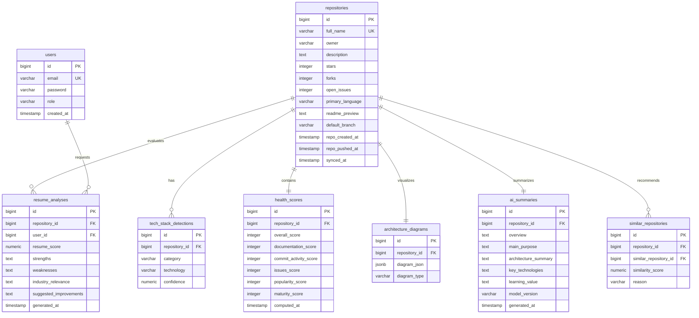
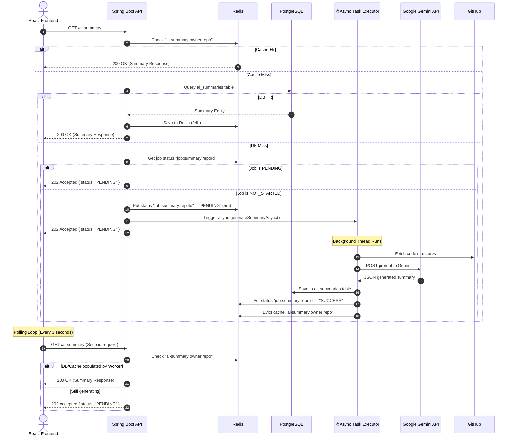

# TitanSearch — Complete Product Requirements Document (PRD)
## AI-Powered Repository Intelligence Platform

> **Project Motto**: *TitanSearch helps developers discover, analyze, compare, understand, and evaluate software repositories. GitHub Search only finds repositories; TitanSearch explains them.*

---

## 1. Executive Summary & Core Value Proposition

TitanSearch addresses the "recruiter and developer trust gap" in open-source exploration. When exploring codebases, developers and technical recruiters face a flood of simple, low-quality, or stale templates. TitanSearch provides a deterministic, secure, and AI-enriched analysis engine to:
1. **Detect Technology Stack & Framework Signatures**: Instantly identify languages, backend APIs, frontend libraries, databases, and container tools.
2. **Compute Repository Health Scores**: Quantify documentation completeness, commit activity, issues backlog ratios, popularity, and maturity metrics.
3. **Map Layered System Architectures**: Layout interactive dependency nodes and edges (Monolith, Static+API, Microservice+Cache) natively using custom SVG rendering.
4. **Generate AI-Enriched Codebase Summaries**: Deliver summaries detailing project overviews, core purpose, architecture, and learning takeaways.
5. **Rate Professional Career/Resume Impact**: Evaluate repository complexity and suggest concrete improvements to make codebase portfolios look professional.

---

## 2. Global Architecture Diagram

Below is the end-to-end containerized system topology representing TitanSearch:

```mermaid
graph TD
    User([Browser Client]) -->|Port 80/443| Nginx[Nginx Reverse Proxy]
    Nginx -->|Static Files| ReactApp[React TypeScript SPA]
    Nginx -->|API Proxy| SpringBoot[Spring Boot Backend]
    
    subgraph Spring Boot Application
        SpringBoot -->|REST| Controllers[Rest Controllers]
        Controllers -->|Filters| RateLimit[RateLimitFilter / Bucket4j]
        Controllers -->|Async Task| AsyncRunner[@Async Task Executor]
        AsyncRunner -->|Generates Prompt| PromptBuilder[PromptBuilder]
        AsyncRunner -->|POST Client| GeminiClient[GeminiClient / RestClient]
    end

    SpringBoot -->|Cache-aside| Redis[(Redis Cache)]
    SpringBoot -->|JPA| Postgres[(PostgreSQL Database)]
    Prometheus[Prometheus Monitor] -->|Scrapes /actuator/prometheus| SpringBoot
    
    GeminiClient -.->|JSON API| GeminiAPI[Google Gemini 1.5 Flash]
    AsyncRunner -.->|HTTP Tree API| GitHubAPI[GitHub REST API]
```

---

## 3. Database Schema Blueprint

TitanSearch relies on three chronological schema migrations (`V1__init.sql`, `V2__analysis_engine.sql`, `V3__ai_layer.sql`):



---

## 4. Heuristic & Scoring Specification

### 4.1 Tech Stack Signatures
Heuristics scan the repository's file tree and check the contents of trigger files to identify frameworks.
* **Spring Boot**: Trigger file `pom.xml` / `build.gradle` containing keyword `spring-boot`.
* **React**: Trigger file `package.json` containing `"react"`.
* **Docker**: Trigger file `Dockerfile` / `docker-compose.yml`.
* **Kubernetes**: Trigger path `k8s/` or trigger files `*.yaml` containing `kind: Deployment`.

### 4.2 Health Score Formula
The overall health score out of 100 is calculated as:
$$\text{Overall} = 0.25 \times \text{Docs} + 0.25 \times \text{Commits} + 0.15 \times \text{Issues} + 0.20 \times \text{Popularity} + 0.15 \times \text{Maturity}$$

* **Documentation (25%)**: Evaluates README characters (max 80 points) + `CONTRIBUTING` guide (+10 points) + `LICENSE` (+10 points).
* **Commit Activity (25%)**: Commit count in the last 90 days scaled: $\min(100, \text{Commits} \times 3.33)$.
* **Issues Health (15%)**: Open issues ratio to project stars: $100 - \min\left(100, \frac{\text{OpenIssues}}{\frac{\text{Stars}}{100} + 1.0}\right)$.
* **Popularity (20%)**: Community validation scaled logarithmically: $\min\left(100, 20.0 \times \ln(\text{Stars} + \text{Forks} + 1.0)\right)$.
* **Maturity (15%)**: Project longevity base score + stale mature penalty (-30 points if no push in 12 months).

---

## 5. AI Layer & Non-Blocking Async Pattern

Long-running Gemini requests take between 3 to 10 seconds. To protect backend HTTP threads from blocking, we implement a **Non-Blocking Async 202 Polling Pattern**:



---

## 6. Frontend Visualizers & Layout Math

### 6.1 Layered Architecture SVG Layout Canvas
To bypass heavy, error-prone javascript graph visualizers, the React frontend renders system nodes and edges natively via SVG:
1. Nodes are assigned a `layer` (`CLIENT`, `PRESENTATION`, `BUSINESS`, `PERSISTENCE`, `CACHE`, `INFRASTRUCTURE`).
2. The canvas height ($H = 500\text{px}$) is divided by the number of active layers, assigning a vertical coordinate ($Y$) to each node card.
3. Nodes within a single layer are spaced horizontally ($X$) using:
   $$X = \frac{\text{Width}}{N + 1} \times (\text{Index} + 1)$$
4. SVG lines connect node coordinates, with arrow end-markers indicating directionality.

### 6.2 Health Ring SVG Dash Offset
The circular health indicator uses SVG circles with the following styling calculations:
* Circle Circumference: $C = 2 \pi r$.
* Dash Offset:
  $$\text{Offset} = C - \left(\frac{\text{Score}}{100}\right) \times C$$
* Transition animations animate the offset value from $C$ down to the calculated coordinate.

---

## 7. Hardening, DevOps & Observability

TitanSearch compiles into an isolated, secure system environment via Docker:
* **Nginx Reverse Proxy**: Exposes ports `80` and `443`. Proxies `/api/` traffic to the backend, serves built static React files, and enforces security headers (`X-Frame-Options`, `Content-Security-Policy`).
* **Prometheus**: Scrapes `/actuator/prometheus` inside the Spring Boot container to monitor heap memory, garbage collection intervals, and request latencies.
* **Grafana**: Configured to display dashboard charts for service health.

---

## 8. Platform Audit Checklist

* [x] **Rate Limiting**: IP-based (60/min) and auth-based (300/min) filters verified using Mockito tests.
* [x] **JWT Security**: Header parser and stateless token validation filters configured.
* [x] **Database Constraints**: Composite unique indexes mapping similarity recommendations and diagrams.
* [x] **Fallback Resilience**: Gemini API failure boundaries defined with graceful recovery logic.
* [x] **Cache Eviction**: Automated evictions on repository updates or fresh summary generation.
